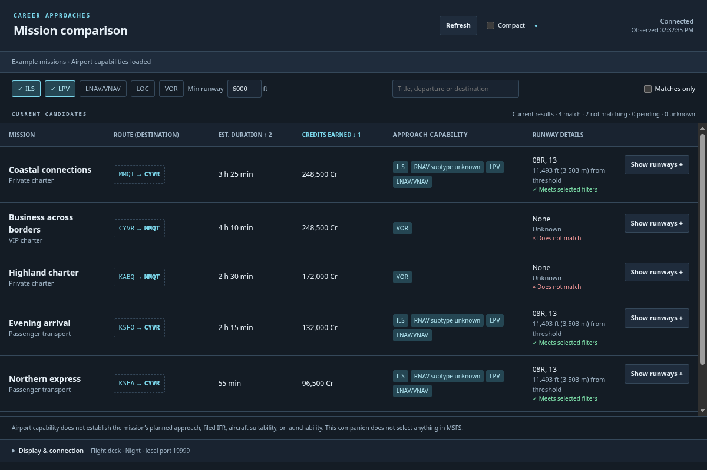
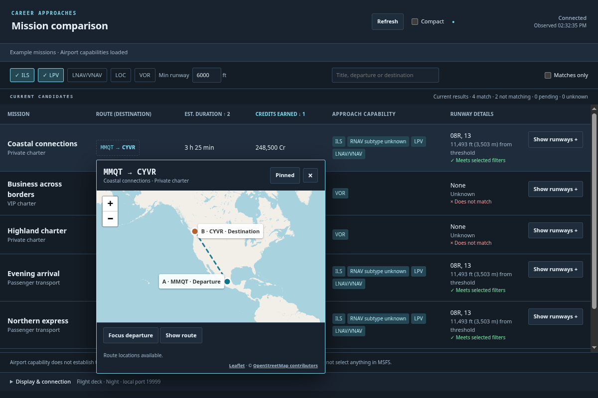
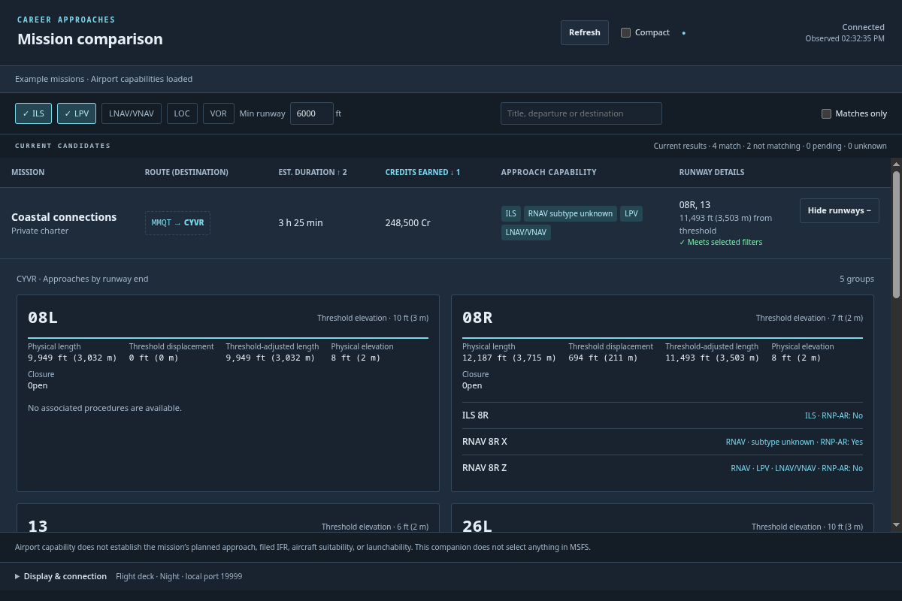
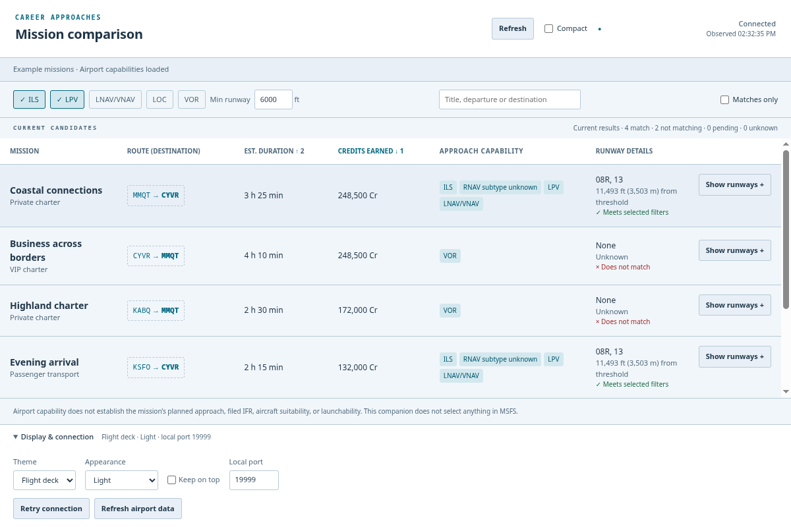
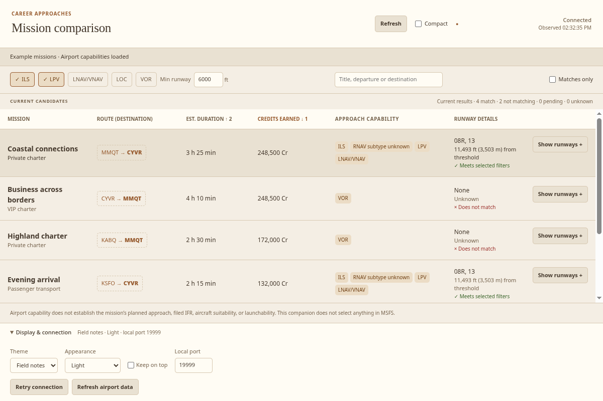
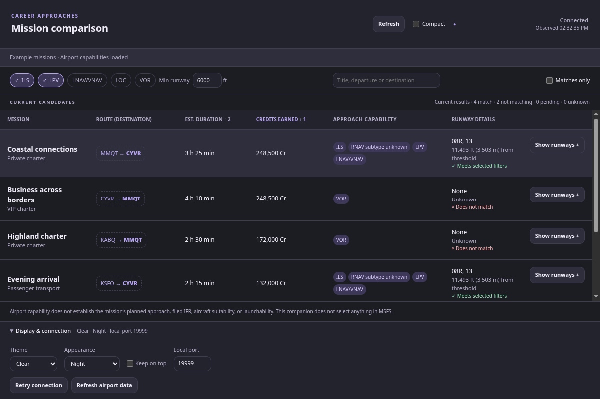

# MSFS 2024 Career Approach Companion

A native Linux and Windows x64 desktop companion for comparing current Microsoft Flight Simulator 2024 Career missions by destination approach capability and runway length. Supports ILS, RNAV (LPV and LNAV/VNAV), LOC and VOR, with expandable runway-end details, advertised payout and estimated duration.

Airport capability does not determine a mission's assigned approach or aircraft suitability. The companion reads simulator data; it does not select missions, change simulator filters, edit routes or modify Career saves.

## Screenshots

Screenshots show the actual app with example missions and representative airport data.

**Sort by what matters.** Click column headings to build an ordered sort: descending, ascending, then off. Numbered arrows show priority. Here, credits are sorted highest first, with shorter flights first when payouts tie. Approach and minimum-runway filters stay visible above the list.



**Find your mission on the map.** Hover a route to preview both airports; click to pin it while switching to MSFS. Focus on the departure or frame the whole route. Map data © [OpenStreetMap contributors](https://www.openstreetmap.org/copyright).



**Inspect individual runway ends.** Expand a mission to see physical and threshold-adjusted lengths, displaced thresholds, elevations, closure status, and available approaches.



**Choose your look.** Flight deck, Field notes and Clear each support Light, Night, or following your system appearance. Display controls also include Compact and supported keep-on-top behavior.

| Flight deck · Light | Field notes · Light | Clear · Night |
| --- | --- | --- |
|  |  |  |

## Run on Linux

Download the application ZIP and `SHA256SUMS` only from [Releases](https://github.com/JarlaxleXenocide/msfs2024-mission-companion/releases). GitHub's source archives are not executable builds.

1. Verify the download with `sha256sum --check --ignore-missing SHA256SUMS` and extract the ZIP into a writable folder. The combined release manifest also lists Windows files that need not be downloaded for this check. Keep the runtime files together.
2. Start MSFS 2024 and enter Career, outside briefing. With the simulator focused, press **G** to expand the native Missions panel so the companion can scan for missions. Keep the panel expanded while scanning.
3. From the extracted application folder, run `./career-companion`.

The bundle includes Electron and Node; users do not need a separate Node installation. Do not run it with sudo or disable its sandbox. It requires an x64 Linux desktop and Electron's system libraries, including NSS, GTK, GBM and ALSA. Debian 12/Ubuntu 22.04 package names include `libnss3 libgtk-3-0 libgbm1 libasound2`; Ubuntu 24.04 uses `libgtk-3-0t64 libasound2t64` for GTK/ALSA.

## Run on Windows

Download Windows packages only from [Releases](https://github.com/JarlaxleXenocide/msfs2024-mission-companion/releases). Choose a release with the Windows setup EXE or portable ZIP. If a release has no Windows packages, use another release that includes them. GitHub's source archives are not executable builds.

1. Download `msfs2024-mission-companion-windows-x64-setup.exe` and `SHA256SUMS` from the same release. Compare the installer's SHA-256 hash with its entry in the checksum file:

   ```powershell
   Get-FileHash -Algorithm SHA256 .\msfs2024-mission-companion-windows-x64-setup.exe
   Select-String -Path .\SHA256SUMS -Pattern ' msfs2024-mission-companion-windows-x64-setup\.exe$'
   ```

2. Run the setup EXE under your normal Windows user account, then launch **MSFS Career Approach Companion** from its installed shortcut.
3. Start MSFS 2024 and enter Career, outside briefing. With the simulator focused, press **G** to expand the native Missions panel so the companion can scan for missions. Keep the panel expanded while scanning. The local Coherent inspector must be available as described below.
4. Use the companion's **Display & connection** footer to change the port or retry if it does not connect.

For portable use, download `msfs2024-mission-companion-windows-x64.zip`, verify its hash against `SHA256SUMS`, extract the entire ZIP, and double-click `career-companion.exe` inside the extracted application folder. Keep its DLLs, resources and other runtime files together; the EXE cannot run on its own. Both distribution formats include Electron and Node, so users do not need a separate Node installation.

Windows packages are unsigned, so Windows may show a trust prompt. Use windowed or borderless simulator mode when placing the companion alongside MSFS.

## Simulator connection and controls

The companion connects to the local Coherent inspector at `127.0.0.1:19999`. The inspector must expose the simulator's main UI and Electronic Flight Bag views. Inspector enablement varies by simulator setup; no automatic configuration changes are made. To check discovery without requesting simulator calculations:

```sh
curl --max-time 3 http://127.0.0.1:19999/pagelist.json
```

On Windows, use PowerShell:

```powershell
Invoke-RestMethod -Uri 'http://127.0.0.1:19999/pagelist.json' -TimeoutSec 3 |
  Select-Object id, title
```

The page list should include `mainUi` and `Electronic Flight Bag`. Page IDs can change; the companion discovers them automatically. The endpoint is `/pagelist.json`, not `/json`. Successful discovery confirms that the inspector is reachable; mission retrieval also requires Career outside briefing with the native Missions panel expanded. If missions are not appearing, focus the simulator and press **G** to expand the panel if it is collapsed.

Use the **Display & connection** footer to change the local port, retry connection, refresh airport data, choose a theme/appearance or enable supported pinning. Filters, search, sorting and Compact affect only the companion. Click a sortable column heading to cycle through descending, ascending, and off. Additional columns become tie-breakers in the order selected; numbered arrows show their priority. With every sort off, missions follow Simulator order. Distance (NM) measures straight-line distance from the Career pilot’s airport to each mission’s departure airport and updates with normal polling. It does not represent aircraft relocation distance or transfer fees. Hover a distance to see the pilot airport used; unavailable distances display “—”. Unknown sort values remain last. Missions scroll independently of the footer.

Routine polling shows **Connected · updating** while retaining the previous observation. Disconnected, inactive and stalled results are marked stale. If a native query stalls, wait for it to settle and follow the displayed recovery guidance. Reconnecting a socket does not cancel simulator-side work; do not open additional clients to bypass a stall.

Linux uses software rendering and defaults to X11/XWayland when `DISPLAY` is available. Explicit `--ozone-platform=x11` and `--ozone-platform=wayland` arguments are respected. Native Wayland has limited minimized-state reporting and uses desktop-managed pinning; the app displays that limitation. Keep-on-top behavior over exclusive-fullscreen games depends on the desktop.

On Linux, preferences are stored under `$XDG_CONFIG_HOME/MSFS Career Approach Companion/preferences.json`, normally `~/.config/MSFS Career Approach Companion/preferences.json`. On Windows, preferences are stored in `%APPDATA%\MSFS Career Approach Companion\preferences.json` after a setting is saved. Mission snapshots and airport data are not persisted.

RNAV labels show the simulator’s reported LPV, LNAV/VNAV, LP and LNAV minima. A runway number does not establish vertical guidance. RNAV procedures with no designated runway are labeled Circling; missing runway identity is labeled Runway unknown. “Minima unavailable” means the simulator did not report a recognized minima type. LPV and LNAV/VNAV filters require explicit simulator flags and a valid associated runway; circling-only procedures cannot satisfy them. These filters describe destination capability, not the mission’s assigned approach. Enable Matches only to hide missions that do not qualify.

## Mission route map

Hover a mission route for 300 ms to preview its airports. Click, Enter or Space pins the map; **Pin map** also keeps a hover preview open. **Show route** frames both endpoints and **Focus departure** zooms to the departure region. Escape or the close button dismisses it. Pinned maps survive filtering, polling and Alt+Tab; stale or removed missions retain a clearly labeled snapshot. Use the existing keep-on-top control when supported by your desktop.

Airport locations come from the simulator. Missing locations are labeled and never invented; the connecting line illustrates endpoints, not a flight plan. Companion helps you locate the departure on the simulator's Career map; mission selection still happens in MSFS.

The basemap streams standard OpenStreetMap images and needs internet access. Only visible previews request imagery, using normal HTTP caching; there is no offline download or map archive. OSM receives image requests revealing the viewed region, not mission titles or GUIDs. If imagery is blocked or unavailable, airport labels and the route remain visible with **Retry imagery**; retry is explicit. Map failures do not interrupt simulator polling. Attribution buttons open the Leaflet and OSM credit pages in your system browser.

## Build and test

Use Node >=22.12.0 (CI uses 22.23.1) and npm. On Linux, install Info-ZIP `zip` for Forge's ZIP maker and `unzip` for distribution-library checks, plus the Electron system libraries listed above:

```sh
npm ci
npm run audit
npm test
npm run typecheck
npx playwright install chromium
npm run make -- --platform=linux --arch=x64
CI=true npm run test:renderer
npm run verify:artifact
```

Renderer tests use synthetic data and never connect to MSFS. On minimal Linux systems, use `npx playwright install --with-deps chromium` to install browser dependencies. Run renderer tests before `npm start`, which replaces intermediate packaged assets with development assets.

Launch development with `npm start`, or run the packaged executable:

```sh
'./out/MSFS Career Approach Companion-linux-x64/career-companion'
```

The portable ZIP and checksum are under `out/make/zip/linux/x64/`. CI checks dependencies, tests, builds, renderer behavior and artifact contents, then checks runtime libraries on Ubuntu 22.04/24.04 and Debian 12.

For a native Windows build, use x64 Windows, PowerShell, Node and npm. Info-ZIP and Linux system libraries are not Windows prerequisites:

```powershell
npm ci
npm run audit
npm test
npm run typecheck
npx playwright install chromium
npm run make -- --platform=win32 --arch=x64
$env:CI = 'true'
npm run test:renderer
node scripts/verify-artifact.cjs --platform=win32 --arch=x64
```

The unpacked Windows runtime is under `out/MSFS Career Approach Companion-win32-x64/`; Forge writes the portable ZIP under `out/make/zip/win32/x64/` and the Squirrel setup files under `out/make/squirrel.windows/x64/`. Final verified Windows delivery files are copied to `out/verified/windows-x64/`.

CI uploads two build artifacts: `linux-x64`, containing the Linux portable ZIP and its manifest, and `windows-x64`, containing the Windows portable ZIP, setup EXE, Squirrel verification inputs and its manifest. A matching version tag combines the public Linux ZIP, Windows ZIP, Windows setup EXE and a new `SHA256SUMS` into one GitHub release. Tag releases remain drafts by default; automatic public publication requires the repository variable `RELEASE_PUBLICATION_ENABLED=true`.

Version tags must match `package.json` with a `v` prefix. Existing releases are never overwritten. The source is currently `UNLICENSED`.

## Acknowledgements

The mission route map uses [Leaflet](https://leafletjs.com/), the open-source mapping library created by Volodymyr Agafonkin and maintained by its contributors. Its BSD 2-Clause copyright notice and full license are reproduced in [THIRD-PARTY-LICENSES.md](THIRD-PARTY-LICENSES.md).

Map data in the route preview is © [OpenStreetMap contributors](https://www.openstreetmap.org/copyright). Use of the public map tiles follows the [OpenStreetMap tile usage policy](https://operations.osmfoundation.org/policies/tiles/).

🇺🇦 [Support Ukraine](https://stand-with-ukraine.pp.ua/) — the resource linked by the Leaflet team in its [Leaflet 1.8 release announcement](https://leafletjs.com/2022/04/18/leaflet-1.8.0.html).
